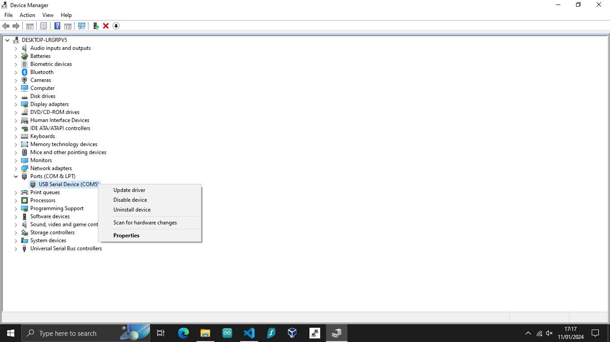

<h1>This is a quick guide to fix the Raspberry Pi Zero 2 W USB OTG connections issues in Windows 10.</h1>

<ul>
    <li>
    Connect the USB cable to the usb port clossest to the HDMI port.
    </li>
    <li>
     Download the mod-duo-rndis.zip driver from this repository.
    </li>
        <li>
    Unzip the folder.
    </li>
    <li>
    Press the windows key and type Device Manager. Open Device Manager
    </li>
    
    <li>
    In Device Manager, under Ports (COM & PLT) you will see the USB Serial Device (COM5*)
    *Could be a different COM
    ** If you do not see the Raspberry Pi here, and the light on the board is on, check your OS installation and USB OTG config.
    </li>
    <li>
    Right click on the USB Serial Device in Ports
    </li>
        <li>
    Click on Update Driver
    </li>
    <li>
    Click on Browse My Computer for Drivers
    </li>
    <li>
    Select the folder you have unzipped. 
    </li>
    <li>
    Now the driver should show as an RNDIS device.
    </li>
    <li>
    To verify it works: Go to Network & Internet Settings
    </li>
    <li>
    You should see your USB Gadget as an Ethernet connection
    </li>
</ul>
    <h2>Congratulations! You can now use Putty to SSH into your Raspberry Pi Zero 2 W. <h2>

